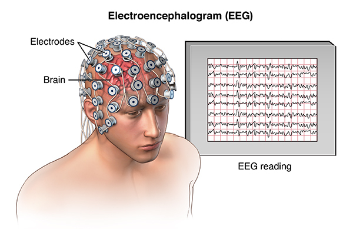

## Brain Structure
Ref: [https://www.ncbi.nlm.nih.gov/books/NBK279302/](https://www.ncbi.nlm.nih.gov/books/NBK279302/)

Brain works like a computer. It takes sensor values from the all body parts and process and evaluates these values and return a response to the related part.  But the processes on the brain is located in different areas in itself according to the kind of process. At the below there are sections of the brain.

### Cerebrum (upper brain)
It is consisted from left hemipshere and right hemisphere.

Each hemisphere is made up of *six areas (lobes)* that have different functions. The cerebrum controls *movement* and processes sensory information. Conscious and unconscious actions and feelings are produced here. It is also responsible for speech, hearing, intelligence and memory.

- Left hemisphere is responsible for speech and and abstract thinking but right hemisphere is responsible for spatial thinking and imagery.
- Left hemisphere is responsible for movement of right side of body and right hemisphere is responsible for movement of left side of body.
- The left cerebral cortex is responsible for speech and language. The right cerebral cortex supplies spatial information, such as where your foot is at the moment.

## How signal generated on brain?
Ref: [https://www.youtube.com/watch?v=OZG8M_ldA1M](https://www.youtube.com/watch?v=OZG8M_ldA1M)
Human body is neutral but the neurons on the brain are loaded by negative in resting state. The potential of an resting neuron is loaded to the -70mV(~). When this neuron is stimulated with biolagical events, this cell takes into itself positive loads from outer area. If the potential gets more than -55mV(~), cell gates are completely opened and it is potential gets to 40mV. After cell positive loaded, it repolarize itself to -80mV. After then, hyperpolarization starts and cell returns to the resting state(-70mV). All these, depolarization, repolarization and hyperpolarization take 2-3ms.

- Resting State 				(~-70mV)
- Threshold State			(~-55mV)
- Depolarized State 		(~ 40mV)
- Hyperpolarized State (~-80mV)

With these steps, one impulse is generated on the brain. These impulse generation are same for all neurons. What makes the difference is frequency of that signals. According to it's frequency different signals generated on the brain and these signals control the body activities.

## What is EEG?

Ref:[https://www.medicine.mcgill.ca/physio/vlab/biomed_signals/eeg_n.htm](https://www.medicine.mcgill.ca/physio/vlab/biomed_signals/eeg_n.htm)

EEG is recording of brain signals from scalp with electrodes. Different electrodes are positioned on the different locations of scalp and activities in all areas(6 area) in both hemispheres of cerebrum  are recorded. As it said before, different areas of the brain responsible for different things and the signals in different frequency in the same area also related with different things on human. These signals give some clues about the brain activity and how is related with human.

Basically, recording EEG is similar to the mind reading. But recording the signal from the scalp makes harder to guess the activites because the signal is weak and too noisy. Obtained signal is not completely same with the signal inside brain. Using machine learning some activities can be predicted from the EEG signal and with the improven technologies these prediction areas are increasing. 

Main frequencies of EEG:
- Delta ( < 3Hz)
- Theta (3.5Hz - 7.5Hz)
- Alpha (7.5Hz - 13Hz)
- Beta ( > 13Hz)
